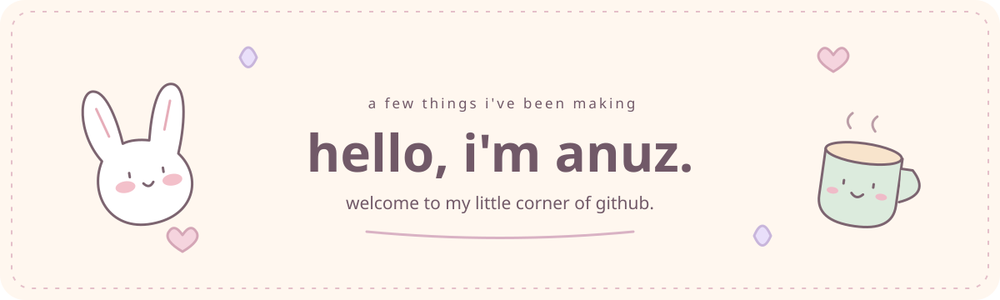
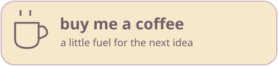

[my website](https://anuz.dev) &nbsp; · &nbsp; [splitt](https://splitt.fund) &nbsp; · &nbsp; [say hello](mailto:hire@anuz.dev)

 

i'm a developer in ontario, canada. i make things for the web, phones, and macs.
a lot of them are little tools for everyday things: sharing a bill, checking email, or getting a thought down before it wanders off.

### my biggest little project

**[splitt.fund](https://splitt.fund)**

an app for shared expenses. keep track of what everyone paid and who owes what, whether it's dinner with friends or a weekend away.

this is the project i'm proudest of. the code is private, but [you can visit it here](https://splitt.fund).

### a few more things on the shelf

| | |
| :--- | :--- |
| **[quickinbox mobile](https://github.com/anuzsubedi/quickinbox-mobile)** | your self-hosted inbox, on android and ios. [get it on google play](https://play.google.com/store/apps/details?id=dev.anuz.quickinbox) |
| **[quivnote](https://github.com/anuzsubedi/quivnote)** | a little markdown notebook that lives in your mac's menu bar. |
| **[xer](https://github.com/anuzsubedi/xer)** | a workspace for building and running xcode apps across your devices. |
| **[remote stats](https://github.com/anuzsubedi/remote-stats)** | a dashboard to see how your computer is doing. |
| **[markdown editor](https://markdown.anuz.dev)** | somewhere to write, preview, and export a document. works in your browser. |

### things in my pencil case

**web** &nbsp; typescript, react, next.js, tailwind 
**native** &nbsp; swift, swiftui, appkit, kotlin, jetpack compose 
**behind the scenes** &nbsp; node.js, python, postgresql, docker, github actions

a peek at my github activity

 

 

---

### thanks for stopping by.

have a project in mind? i'd love to hear about it. 
or, if something i've made has been useful, you can buy me a coffee.

 

&nbsp;

  

[anuz.dev](https://anuz.dev) &nbsp; · &nbsp; [hire@anuz.dev](mailto:hire@anuz.dev)

