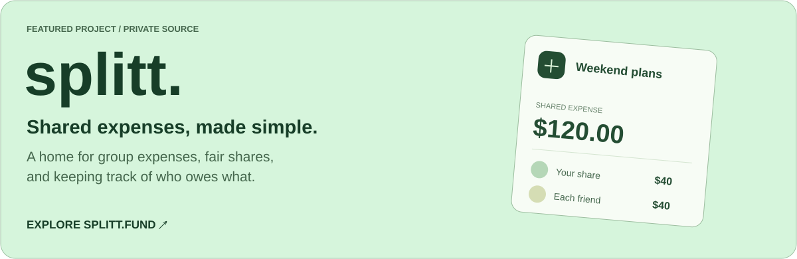
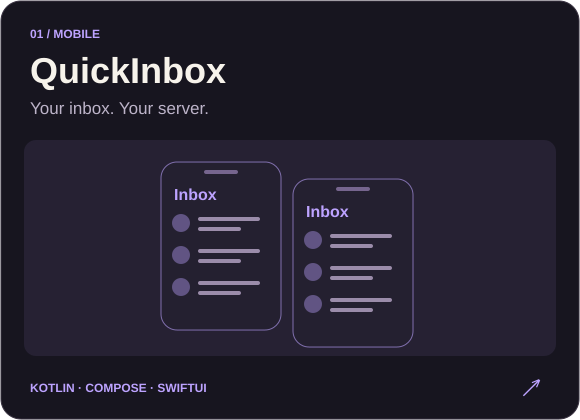
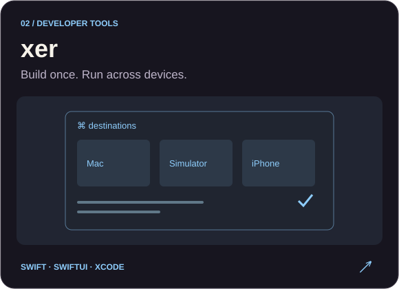
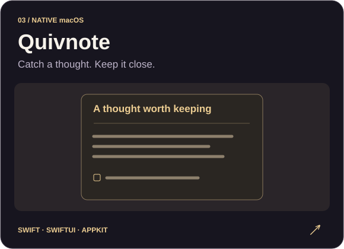
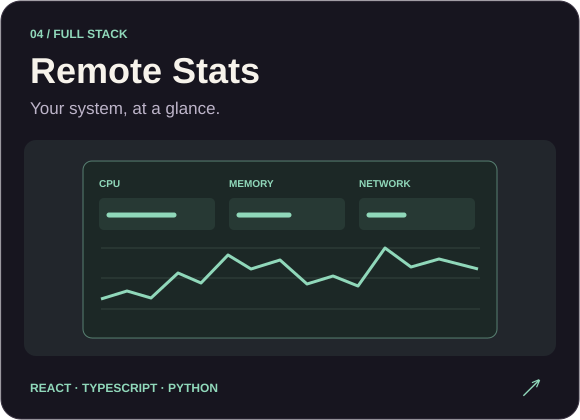

  <a href="https://anuz.dev"><strong>PORTFOLIO ↗</strong></a> &nbsp; &nbsp; · &nbsp; &nbsp;
  <a href="https://splitt.fund"><strong>SPLITT.FUND ↗</strong></a> &nbsp; &nbsp; · &nbsp; &nbsp;
  <a href="mailto:hire@anuz.dev"><strong>WORK WITH ME ↗</strong></a>

 

I'm **Anuz**, a developer in Ontario, Canada. I build web products and native apps, with a focus on thoughtful interfaces and the details that make software feel good to use.

### The main project

**[splitt.fund ↗](https://splitt.fund)** — My flagship project: an app for splitting shared expenses and keeping track of balances between friends. **Private source · [Visit the product](https://splitt.fund)**

 

### More things I've built

<table>
<tr>
<td width="50%" valign="top">

Native clients for self-hosted email, with QR pairing, threaded conversations, and secure credential storage.

<a href="https://github.com/anuzsubedi/quickinbox-mobile"><strong>Code ↗</strong></a> &nbsp; · &nbsp; <a href="https://play.google.com/store/apps/details?id=dev.anuz.quickinbox">Google Play ↗</a>

</td>
<td width="50%" valign="top">

Build, install, launch, and monitor Xcode apps across your Mac, simulators, and connected devices.

<a href="https://github.com/anuzsubedi/xer"><strong>Code ↗</strong></a>

</td>
</tr>
<tr>
<td width="50%" valign="top">

A shortcut away from your next note. A menu-bar notebook with Markdown editing and a searchable local library.

<a href="https://github.com/anuzsubedi/quivnote"><strong>Code ↗</strong></a>

</td>
<td width="50%" valign="top">

A system monitoring dashboard for CPU, memory, storage, network, and processes, backed by a Python API.

<a href="https://github.com/anuzsubedi/remote-stats"><strong>Frontend ↗</strong></a> &nbsp; · &nbsp; <a href="https://github.com/anuzsubedi/remote-stats-server">Backend ↗</a>

</td>
</tr>
</table>

Project illustrations are stylized, not application screenshots.

**Also worth a look:** [Markdown Editor](https://markdown.anuz.dev) — write, preview, and export documents in your browser. [Source ↗](https://github.com/anuzsubedi/markdown-editor)

 

### My toolkit

**Web** &nbsp; TypeScript · React · Next.js · Tailwind CSS 
**Native** &nbsp; Swift · SwiftUI · AppKit · Kotlin · Jetpack Compose 
**Backend & tools** &nbsp; Node.js · Python · PostgreSQL · Docker · GitHub Actions

 

<a href="https://anuz.dev">anuz.dev</a> &nbsp; / &nbsp; <a href="mailto:mail@anuz.dev">mail@anuz.dev</a>

