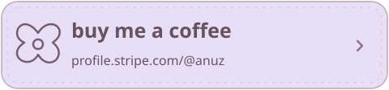
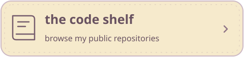
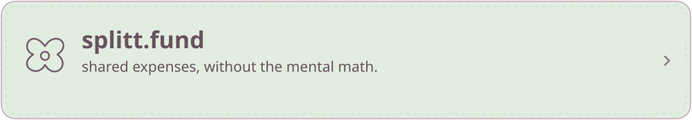
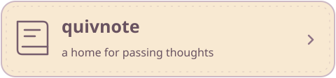
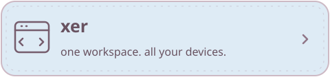
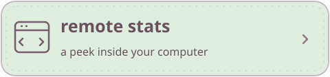
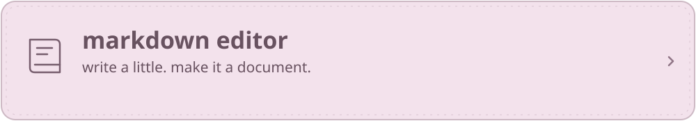

 

  

i'm anuz, an independent developer. 
i make things i need and share them with others who might find them useful too.

 

### my biggest little project

split a dinner bill, keep track of a trip, or figure out who owes what. 
this is the project i'm proudest of. the source is private; [the app is here](https://splitt.fund).

 

### a few more things on the shelf

 

 

[quickinbox on google play](https://play.google.com/store/apps/details?id=dev.anuz.quickinbox) · [remote stats backend](https://github.com/anuzsubedi/remote-stats-server) · [markdown editor source](https://github.com/anuzsubedi/markdown-editor)

 

### things in my pencil case

**web** &nbsp; typescript, react, next.js, tailwind 
**native** &nbsp; swift, swiftui, appkit, kotlin, jetpack compose 
**behind the scenes** &nbsp; node.js, python, postgresql, docker, github actions

a peek at my github activity

 

 

thanks for stopping by. make yourself at home.

[anuz.dev](https://anuz.dev) &nbsp; · &nbsp; [hire@anuz.dev](mailto:hire@anuz.dev) &nbsp; · &nbsp; [stripe](https://profile.stripe.com/@anuz)

