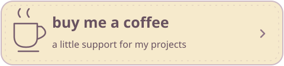
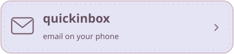
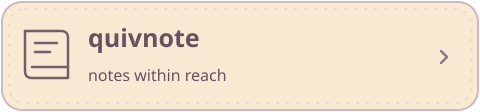
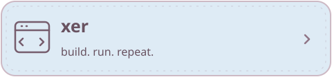
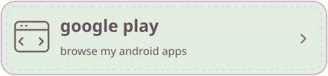
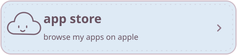

 

  

i'm anuz, an independent developer. 
i make things i need and share them with others who might find them useful too.

 

### my biggest little project

split a dinner bill, keep track of a trip, or figure out who owes what. 
this is the project i'm proudest of. the source is private. tap the banner to take a look.

 

### a few more things on the shelf

 

### little apps, out in the world

 

### things in my pencil case

**web** &nbsp; typescript, react, next.js, tailwind 
**native** &nbsp; swift, swiftui, appkit, kotlin, jetpack compose 
**behind the scenes** &nbsp; node.js, python, postgresql, docker, github actions

a peek at my github activity

 

 

thanks for stopping by. make yourself at home.

