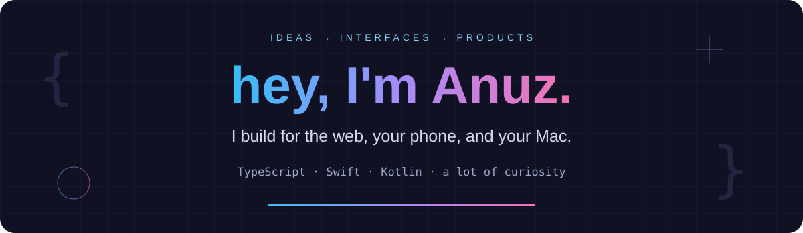

  

**Developer in Ontario, Canada.** 
Turning everyday problems into web products, native apps, and useful little tools.

 

## 🚀 Currently building: [splitt.fund](https://splitt.fund)

### Shared plans. Fair shares. Less mental math.

My flagship project brings shared expenses and balances into one place, so friends can keep track of who owes what.

 

## ⚡ From my workbench

| Project | What it does | Built with |
| :--- | :--- | :--- |
| 📬 **[QuickInbox Mobile](https://github.com/anuzsubedi/quickinbox-mobile)** | Native email clients for your self-hosted inbox. [Google Play ↗](https://play.google.com/store/apps/details?id=dev.anuz.quickinbox) | Kotlin · Compose · SwiftUI |
| 🛠️ **[xer](https://github.com/anuzsubedi/xer)** | Build and launch Xcode apps across Macs, simulators, and devices. | Swift · SwiftUI |
| 📝 **[Quivnote](https://github.com/anuzsubedi/quivnote)** | A Markdown notebook tucked into your Mac's menu bar. | Swift · AppKit |
| 📊 **[Remote Stats](https://github.com/anuzsubedi/remote-stats)** | A live dashboard for your system's vitals. [Backend ↗](https://github.com/anuzsubedi/remote-stats-server) | React · TypeScript · Python |
| ✍️ **[Markdown Editor](https://github.com/anuzsubedi/markdown-editor)** | Write, preview, and export documents in the browser. [Try it ↗](https://markdown.anuz.dev) | React · TypeScript |

 

## 🧩 The toolkit

  

**Web to native. Interface to backend.**

 

## 📈 Behind the commits

---

### Build with me. Or buy the next coffee. ☕

&nbsp;

  

**[anuz.dev](https://anuz.dev)** &nbsp; · &nbsp; **[hire@anuz.dev](mailto:hire@anuz.dev)**

